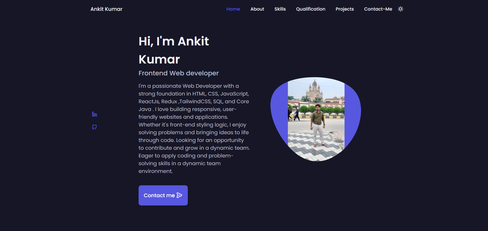

# 🌐 My Developer Portfolio

Welcome to my personal portfolio website — a space where I showcase my skills, projects, and passion for web development. Designed with simplicity and elegance in mind, this portfolio is a reflection of my journey as a **Frontend Web Developer**.

---

## 🧩 About This Website

This portfolio serves as my digital resume and project gallery. It highlights the tools and technologies I work with and gives visitors a look at the real projects I've built. Every section is carefully crafted to be clean, responsive, and user-friendly.

---

## ✨ Features

- 🧑‍💻 About Me section – Who I am and what I do  
- 🛠 Skills section – The technologies I work with  
- 📁 Projects showcase – With links and images  
- 📬 Contact form – For easy communication  
- 🌙 Light & dark mode (optional, if added)  
- 📱 Fully responsive – Works on all screen sizes

---

## 🛠 Technologies Used

- **HTML** – Structure of the website  
- **CSS** – Styling, layout, animations  
- **JavaScript** – Interactivity and dynamic content  
- *(Optional: React, GSAP, etc., if used)*

---

## 📷 Adding a Project Screenshot

> To add your portfolio screenshot:  
> 1. Create an `images` folder in your project.  
> 2. Save your screenshot as `portfolio-screenshot.png` (or any name you prefer).  
> 3. Update this line with the correct path:

 <!-- Replace with your actual image path -->